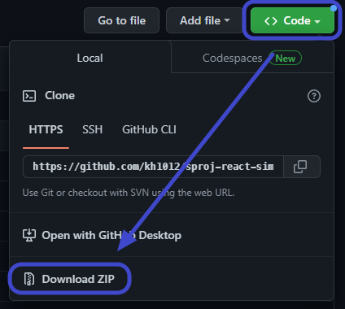
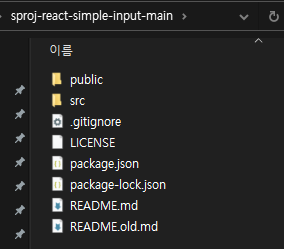
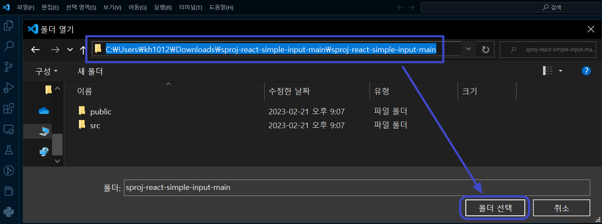
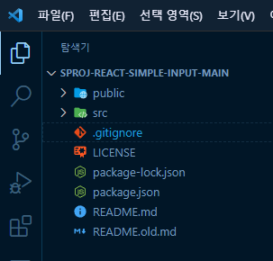
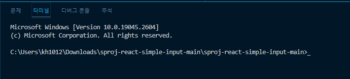
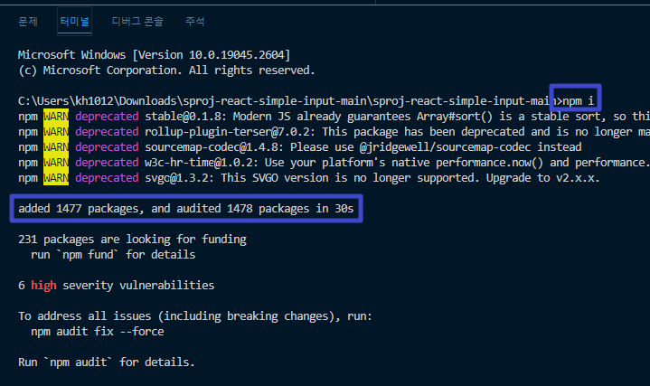
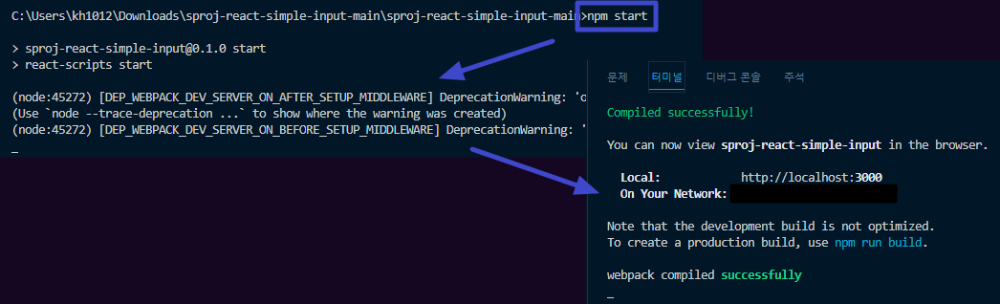
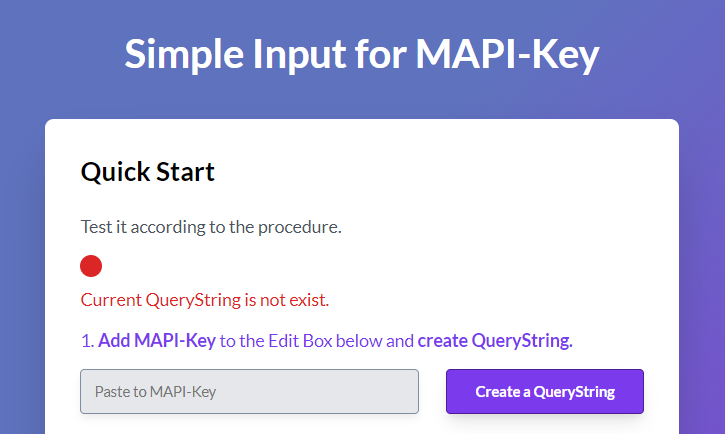
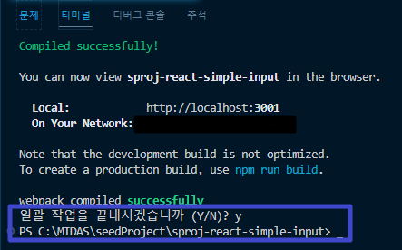
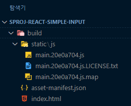

# :zap: Getting Stated With React Simple Input

MIDAS API 중 "GET NODE"를 통해 API를 경험할 수 있는 저장소 입니다.\
HTML 대신 [React 라이브러리](https://ko.reactjs.org/) 를 사용하여 가독성있는 웹 페이지를 제작할 수 있습니다.\
전체적인 구조는 HTML과 비슷하지만, 고정 된 `index.html`에 `index.js`로 활력을 불어 넣어 보세요!
  

## [Demo Page](https://kh1012.github.io/sproj-react-simple-input/build/index.html)
위 링크를 클릭하시면 테스트 페이지를 보실 수 있습니다.
  

## Prerequisite

해당 저장소를 사용하려면 [Getting Started With React](https://github.com/kh1012/sproj-prerequisite/tree/main/react)에 포함된 환경이 모두 구성되어 있어야 합니다. \
가능한 안내 된 프로그램을 다운로드 받으시고 최신 버전을 사용하는 것이 좋습니다. `LTS`
  

## Quick Start

해당 저장소를 사용하기 위한 준비 과정을 안내합니다.
  

### 자신의 PC에 저장소 다운로드 받기
 

- 현 페이지 우측 상단에 `Code` 버튼을 눌러 `Download ZIP`을 클릭하여 저장소를 다운로드 받습니다.\
   
  
- 다운로드가 완료되면 원하는 경로에 압축을 해제 합니다.\
  HTML 저장소 보다 조금 더 많은 파일이 포함된 것을 확인할 수 있습니다.\
   
  
  

### 사용을 위한 패키지 설치하기
 

- `react`의 경우에는 `index.html`을 바로 실행할 경우, 일반적으로 웹페이지에 아무것도 표시 되지 않습니다.\
  웹페이지가 로드 될 때, javascript 파일을 통해 html을 동적으로 변경 시켜주는 방식으로 동작 합니다.\
  (자세한 내용을 확인하려면 [react-엘리먼트 렌더링](https://ko.reactjs.org/docs/rendering-elements.html) 을 참고 하세요.)\
  따라서 바로 실행할 수 없고 실행하는데에 필요한 몇몇 패키지를 설치하여야 합니다.\
   
- 이전에 `NodeJS`를 설치 할 때, node package manager (npm)가 함께 설치 되었을 겁니다.\
  npm은 NodeJS에서 사용하는 다양한 라이브러리를 손쉽게 설치하고 관리할 수 있도록 도와주는 패키지 입니다.\
  또한, npm은 VSCode 터미널 창에서 `npm 명령어`의 형태로 입력이 가능 합니다.\
  [npm-docs](https://docs.npmjs.com/)에서 npm에 대한 다양한 자료를 확인해보세요.\
   
- 이전에 설치 된 `VSCode`를 실행 합니다.\
  `파일 - 폴더 열기...` 혹은 `Ctrl + K, O` 을 이용하여 압축해제했던 다운로드 폴더를 엽니다.\
   
  \
   
  아래와 같이 `탐색기`가 변경된 걸 볼 수 있습니다.\
   
  \
   
- 패키지 설치를 위해 `VSCode`의 `보기 - 터미널`을 선택하여 터미널을 활성화 합니다.\
   
  \
   
  활성화 된 터미널에 `npm i` 혹은 `npm install`이라고 입력하고 실행 합니다.\
  (이전에 `NodeJS`를 설치했다면 npm(node pacakage manager)를 실행할 수 있습니다.)\
  자동으로 패키지가 설치되면서 완료 문구가 뜹니다.\
   
  
  

### 실행하기
 

- `npm start`\
  웹페이지를 실행하려면 이전에 사용했던 터미널에서 `npm start`를 쳐보세요.\
   
  \
   
  
  

### 중단하기
 

- `Ctrl + C`\
  실행된 react 서버를 종료 시키려면 활성화된 터미널을 클릭하고 `Ctrl + C`를 눌러보세요.\
   
  \
   
  위와 같이 작업 종료 메세지가 나오고 커서가 깜빡이는 상태가 된다면 정상적으로 중단된 것 입니다.
  

### 빌드하기
 

- `npm run build`\
  react로 MIDAS API Plugin을 작성하고 업로드 하기 위해서는 react를 통해 잘 만들어진 결과 파일만 있으면 됩니다.\
  개발환경에서 사용하는 모든 데이터를 업로드 할 필요 없이 최적화 된 html, javascript 파일등을 추출할 수 있습니다.\
  이러한 과정을 build라 부릅니다.\
  터미널에서 `npm run build`를 쳐보세요.\
   
  \
   
  위와 같은 결과파일들을 MIDAS API Plugin 사이트에 업로드 하면 됩니다.
  

### 주요 코드 설명
 

- HTML과 달리 내부 폴더는 크게 /public과 /src가 존재합니다.
  - `/public`
    - index.html 파일이 있습니다. \
      기존 HTML과 달리 `<body>`태그 내부에는 `
`만 존재 합니다.\
      이전에 설명 드렸던 것 처럼 id="root"의 div 객체를 `/src/index.js`에 의해 동적으로 변환 합니다.
  - `/src`
    - react 라이브러리를 사용한 javascript 파일이 존재합니다.
      - 주요한 변수 및 함수는 다음과 같습니다.
        - `baseUrl`: MIDAS API Server의 Url 입니다.
        - function `getMapiKey()`: URL QueryString으로부터 MAPI-Key를 가져오는 함수 입니다.
        - function `getNodeFetch()`: MIDAS API를 통해 연결된 제품의 Node 정보를 가져 옵니다.
        - 웹 페이지에 표현을 담당하는 HTML 부분이 존재합니다. [MDN-HTML](https://developer.mozilla.org/ko/docs/Web/HTML)
        - ul, li 태그를 활용하여 리스트로 표현되어 있습니다.
          - [MDN-ul](https://developer.mozilla.org/ko/docs/Web/HTML/Element/ul)에 대해 확인해 보세요!
          - [MDN-li](https://developer.mozilla.org/ko/docs/Web/HTML/Element/li)에 대해 확인해 보세요!